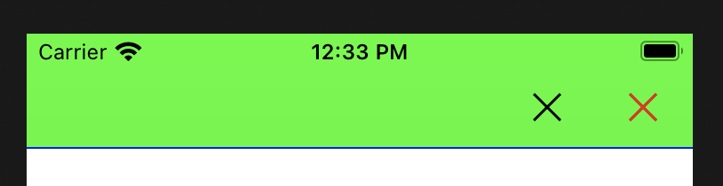

# DennyNavigationBar
Easily editable UINavigationBar

## 1) DennyNavigationItem
```swift
var rightButtonCount: Int
func addRightButton(title: String?, style: UIBarButtonItem.Style, target: Any?, action: Selector?)
```

## 2) DennyNavigationBar
```swift
func setBackButtonImage(image: UIImage?)
func setBottomBorderHidden(isHidden: Bool)
func removeBottomBorder()
func setBackgroundColor(color: UIColor)
func setBottomBorderColor(color: UIColor, height: CGFloat = (1.0 / UIScreen.main.scale))
```
## How To Use  
### Use Cocoapods  
In Podfile
```swift
pod 'DennyNavigationBar'
```

### Import Framework  
```swift
import DennyNavigationBar
```
### Configure Bar Style  
```swift
class ViewController: UIViewController {
    
    override func viewDidLoad() {
        super.viewDidLoad()
        if let navigationBar = self.navigationController?.navigationBar as? DennyNavigationBar {
            navigationBar.setBottomBorderColor(color: .blue)
            navigationBar.setBackgroundColor(color: .green)
            navigationBar.setButtonTintColor(color: .red)
        }
    }
}
```
If you want to remove bottom Border, use navigationBar.removeBottomBorder().  
```swift
navigationBar.removeBottomBorder()
```
To set up the Bar Hidden property, use it as follows:  
```swift
navigationBar.setBottomBorderHidden(isHidden: true)
navigationBar.setBottomBorderHidden(isHidden: false)
```

### Configure Bar Button  
Make some selector functions for button events.  
```swift
@objc
private func setOnClickButton1(_ sender: Any?) {
    print("Denny Nav. Button 1")
}
    
@objc
private func setOnClickButton2(_ sender: Any?) {
    print("Denny Nav. Button 2")
}
```
You can define the number of buttons.  
If you define the number of Buttons, the Bar Buttons are automatically adjusted to the number defined.  
```swift
navigationItem.rightButtonCount = 2
```

Text Style Bar Button  
```swift
if let navigationItem = self.navigationItem as? DennyNavigationItem {
    navigationItem.rightButtonCount = 2
    navigationItem.addRightButton(title: "버튼1", style: .plain, mode: .original, target: self, action: #selector(setOnClickButton1(_:)))
    navigationItem.addRightButton(title: "버튼2", style: .plain, mode: .original, target: self, action: #selector(setOnClickButton2(_:)))
    }
}
```
Image Style Bar Button  
```swift
if let navigationItem = self.navigationItem as? DennyNavigationItem {
    navigationItem.rightButtonCount = 2
    navigationItem.addRightButton(image: UIImage(named: "closeImg"), style: .plain, mode: .automatic, target: self, action: #selector(setOnClickButton1(_:)))
    navigationItem.addRightButton(image: UIImage(named: "closeImg"), style: .plain, mode: .original, target: self, action: #selector(setOnClickButton2(_:)))
    }
}
```
## Sample Screenshot  
 
